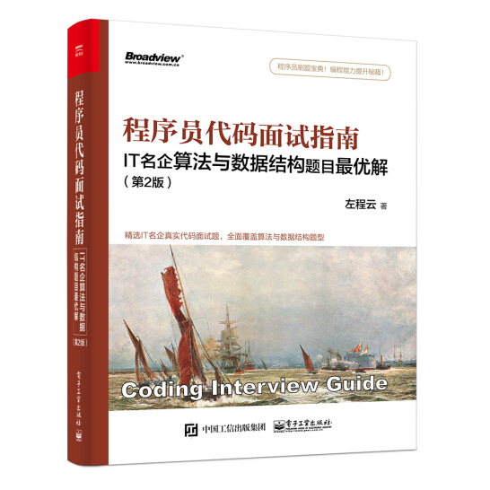

# CodingInterviewGuide
《程序员代码面试指南 IT名企算法与数据结构题目最优解 第2版》笔记  

[第1章栈和队列](./notes/第1章栈和队列.md)  
[第2章链表问题](./notes/第2章链表问题.md)  
[第3章二叉树问题](./notes/第3章二叉树问题.md)  
[第4章递归和动态规划](./notes/第4章递归和动态规划.md)  
[第5章字符串问题](./notes/第5章字符串问题.md)  
[第6章大数据和空间限制](./notes/第6章大数据和空间限制.md)  
[第7章位运算](./notes/第7章位运算.md)  
[第8章数组和矩阵问题](./notes/第8章数组和矩阵问题.md)  
[第9章其他题目](./notes/第9章其他题目.md)  
--- 

